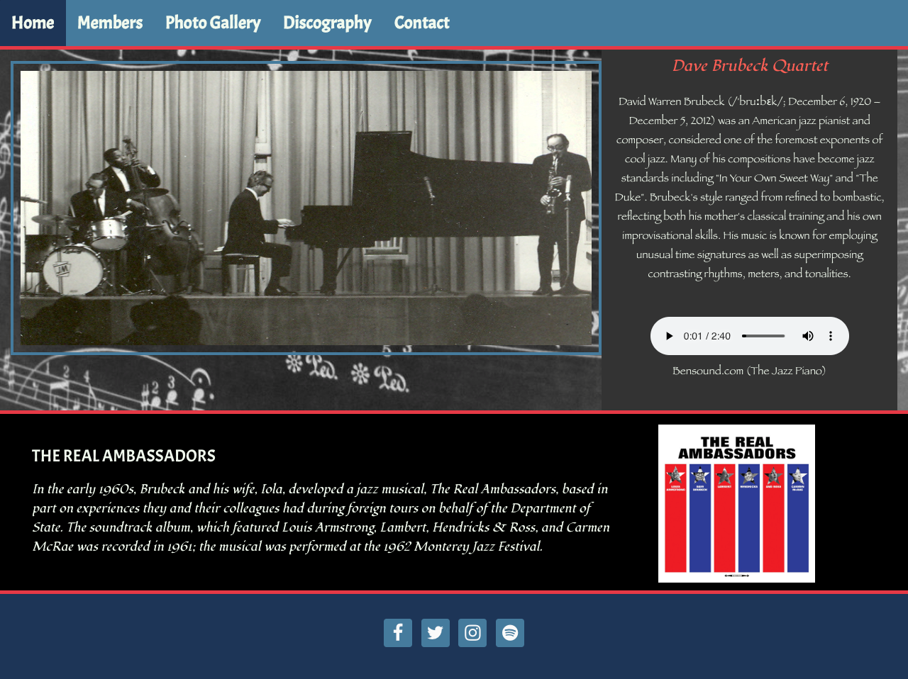

<h1 align="center">Dave Brubeck Quartet Website</h1>

[View the live project here.](https://heyson.github.io/user-centric-frontend-dev-milestone-project/)

This is a fan site for people who want to learn more about the David Brubeck Quartet. Visitors can explore quartet member bios, the full commercial discography, view some images of the band, view David Brubecks social media accounts and finally reach out to the band in the contacts page.

<h2 align="center"></h2>

## User Experience (UX)

-   ### User stories

    -   #### First Time Visitor Goals

        1. As a First Time Visitor, I want to know who was in the David Brubeck Quartet .
        2. As a First Time Visitor, I want to be able to get a brief biography of all the members of the quartet from the years 1951 to 2012 .
        3. As a First Time Visitor, I want to see the entire commercial discography of the David Brubeck Quartet.

    -   #### Returning Visitor Goals

        1. As a Returning Visitor, I want to reference facts about the quartet members.
        2. As a Returning Visitor, I want to research albums and their release dates.
        3. As a Returning Visitor, I want to view the social media accounts of David Brubeck.
        4. As a Returning Visitor, I want to be able to get in contact with The David Brubeck Quartet.


-   ### Design
    -   #### Colour Scheme - Coolors Trending color palettes
        -   The main colors for the site were obtained from Coolors.co. https://coolors.co/palettes/trending I used these hex values #A8DADC,#333, #1D3557, #457B9D,#F1FAEE,#BDD5EA,#E63946,.
    -   #### Typography
        -   The Fondamento, Fantasy and Acme fonts are the main fonts used throughout the whole website with Serif as the fallback font.
    -   #### Imagery
        -   Images were sourced from multiple locations to construct the look and feel of the Quartets history.
        -   ####Source and Credit for images used in Members page.

            -   dave-brubeck-quartet1.jpg
                https://www.nationalww2museum.org/war/articles/wwii-dave-brubeck-jazz-musician

            -   dave-brubeck-quartet2.jpg
                https://musicaficionado.blog/2019/12/14/time-out-by-the-dave-brubeck-quartet/

            -   dave-brubeck-quartet3.jpg
                https://jazz.fm/dave-brubeck-quartet-take-five-proved-you-could-play-jazz-in-5-4-time/

            -   dave-brubeck-quartet4.jpg
                https://www.youtube.com/watch?v=Z4Zq1-qfA5U

            -   dave-brubeck-quartet5.jpg
                https://silviutolu.com/dave-brubeck/

            -   dave-brubeck-quartet6.jpg
                https://pastdaily.com/2017/03/26/dave-brubeck-1967-past-daily-downbeat/dave-brubeck-resize-10/

            -   dave-brubeck-quartet7.jpg
                https://www.npr.org/2000/11/19/1114201/take-five

            -   dave-brubeck-quartet8.jpg
                https://www.allaboutjazz.com/desmond-after-dark-with-the-dave-brubeck-quartet-paul-desmond-by-michael-ricci.php

            -   dave-brubeck-quartet9.jpg
                https://www.bbc.co.uk/programmes/b00jh665

            -   dave-brubeck-quartet10.jpg
                https://www.list.co.uk/article/115182-philip-clark-on-dave-brubeck-he-was-a-great-individual-in-a-music-that-is-supposed-to-be-all-about-great-individuals/

            -   dave-brubeck-quartet11.jpg
                https://www.npr.org/2012/12/20/167654793/dave-brubeck-quartet-on-jazzset

            -   dave-brubeck-quartet12.jpg
                https://pastdaily.com/2018/04/29/dave-brubeck-quartet-london-1966-past-daily-downbeat/

            -   dave-brubeck-quartet13.jpg
                https://www.civilrightsmuseum.org/dave-brubeck-jazz-ambassador

            -   dave-brubeck-quartet14.jpg
                https://www.wrti.org/post/dave-brubecks-time-out-why-it-so-great

            -   dave-brubeck-quartet15.jpg
                http://www.davebrubeckjazz.com/Images/Classic-Quartet

            -   dave-brubeck-quartet16.jpg
                https://www.youtube.com/watch?v=Tm-o8GIMtHQ


         ####Source and credit for images used in Discography page

            -   davebrubeckjazz.com/***************************************************************************************
                        *    Title: <Album art and Titles credited to davebrubeckhazz.com> 
                        *    Author: <davebrubeckjazz.com>
                        *    Date: <7/19/20>
                        *    Availability: <http://www.davebrubeckjazz.com/Recordings/Release/Commercial#info>


### Wireframes - Balsamiq

    -   Desktop Wireframe - (PDF under /wireframe directory)

    -   Tablet Wireframe - (PDF under /wireframe directory)

    -   Mobile Wireframe - (PDF under /wireframe directory)

## Features

-   Responsive on all device sizes

-   Interactive elements

## Technologies Used

### Languages Used

-   [HTML5](https://en.wikipedia.org/wiki/HTML5)
-   [CSS3](https://en.wikipedia.org/wiki/Cascading_Style_Sheets)

### Frameworks, Libraries & Programs Used

1. [Bootstrap 4.4.1:](https://getbootstrap.com/docs/4.4/getting-started/introduction/)
    - Bootstrap was used to assist with the responsiveness and styling of the website.
1. [Hover.css:](https://ianlunn.github.io/Hover/)
    - Hover.css was used on the Social Media icons in the footer to add the float transition while being hovered over.
1. [Google Fonts:](https://fonts.google.com/)
    - Google fonts were used to import the 'Fondamento and Acme' fonts into the style.css file which is used on all pages throughout the project.
1. [Font Awesome:](https://fontawesome.com/)
    - Font Awesome was used on all pages throughout the website to add icons for aesthetic and UX purposes.
1. [jQuery:](https://jquery.com/)
    - jQuery came with Bootstrap to make the navbar responsive but was also used for the smooth scroll function in JavaScript.
1. [Git](https://git-scm.com/)
    - Git was used for version control by utilizing the Gitpod terminal to commit to Git and Push to GitHub.
1. [GitHub:](https://github.com/)
    - GitHub is used to store the projects code after being pushed from Git.
1. [Gimp:](https://www.gimp.org/)
    - Photoshop was used to create the logo, resizing images and editing photos for the website.
1. [Balsamiq:](https://balsamiq.com/)
    - Balsamiq was used to create the wireframes during the design process.
1. [Awesome Screenshots:](https://www.awesomescreenshot.com/)
    - Awesome Screenshots was used to create the screenshots during the documentation process.

## Testing

The W3C Markup Validator and W3C CSS Validator Services were used to validate every page of the project to ensure there were no syntax errors in the project.

-   [W3C Markup Validator](https://jigsaw.w3.org/css-validator/#validate_by_input) - [Results](/w3c-validator)
-   [W3C CSS Validator](https://jigsaw.w3.org/css-validator/#validate_by_input) - [Results](/w3c-validator)

### Testing User Stories from User Experience (UX) Section

-   #### First Time Visitor Goals

    1. As a First Time Visitor, I want to easily understand the main purpose of the site and learn more about the Dave Brubeck Quartet.

        1. As a First Time Visitor, I want to know who was in the David Brubeck Quartet .
        2. As a First Time Visitor, I want to be able to get a brief biography of all the members of the quartet from the years 1951 to 2012 .
        3. As a First Time Visitor, I want to see the entire commercial discography of the David Brubeck Quartet.

    2. As a First Time Visitor, I want to be able to easily be able to navigate throughout the site to find content.

        1. The site has been designed to be informative about the quartet members.
        2. At the top of all the pages there is clear navigation to direct you to all pages available.

-   #### Returning Visitor Goals

    1. As a Returning Visitor, I want to find the new programming challenges or hackathons.

        1. There are reference to facts about the quartet members.
        2. Visitors, can research albums and their release dates.
        3. Returning Visitors can link to view the social media accounts of David Brubeck.
        4. Returning Visitors are able to get in contact with The David Brubeck Quartet.

### Further Testing

-   The Website was tested on Google Chrome, Internet Explorer, Microsoft Edge and Safari browsers.
-   The website was viewed with a variety of devices such as Desktop, Laptop, iPhone7, iPhone 8 & iPhoneX with the use of Chrome [DevTools](https://developers.google.com/web/tools/chrome-devtools).
-   A large amount of testing was done to ensure that all pages were linking correctly.
-   Lighthouse Auditor was used to review the site and provide documentation to point out any bugs and/or user experience issues. Results located in lighthouse-audit directory

### Known Bugs

-  Any improvements that can be made to the site to achieve a better performance score has been documented in the lighthouse audit reports.

## Deployment

### GitHub Pages

The project was deployed to GitHub Pages using the following steps...

1. Log in to GitHub and locate the [GitHub Repository](https://github.com/)
2. At the top of the Repository (not top of page), locate the "Settings" Button on the menu.
    - Alternatively Click [Here](https://raw.githubusercontent.com/) for a GIF demonstrating the process starting from Step 2.
3. Scroll down the Settings page until you locate the "GitHub Pages" Section.
4. Under "Source", click the dropdown called "None" and select "Master Branch".
5. The page will automatically refresh.
6. Scroll back down through the page to locate the now published site [link](https://github.com) in the "GitHub Pages" section.

### Forking the GitHub Repository

By forking the GitHub Repository we make a copy of the original repository on our GitHub account to view and/or make changes without affecting the original repository by using the following steps...

1. Log in to GitHub and locate the [GitHub Repository](https://github.com/Heyson/user-centric-frontend-dev-milestone-project)
2. At the top of the Repository (not top of page) just above the "Settings" Button on the menu, locate the "Fork" Button.
3. You should now have a copy of the original repository in your GitHub account.

### Making a Local Clone

1. Log in to GitHub and locate the [GitHub Repository](https://github.com/Heyson/user-centric-frontend-dev-milestone-project)
2. Under the repository name, click "Clone or download".
3. To clone the repository using HTTPS, under "Clone with HTTPS", copy the link.
4. Open Git Bash
5. Change the current working directory to the location where you want the cloned directory to be made.
6. Type `git clone`, and then paste the URL you copied in Step 3.

```
$ git clone https://github.com/YOUR-USERNAME/YOUR-REPOSITORY
```

7. Press Enter. Your local clone will be created.

```
$ git clone https://github.com/YOUR-USERNAME/YOUR-REPOSITORY
> Cloning into `CI-Clone`...
> remote: Counting objects: 10, done.
> remote: Compressing objects: 100% (8/8), done.
> remove: Total 10 (delta 1), reused 10 (delta 1)
> Unpacking objects: 100% (10/10), done.
```

Click [Here](https://help.github.com/en/github/creating-cloning-and-archiving-repositories/cloning-a-repository#cloning-a-repository-to-github-desktop) to retrieve pictures for some of the buttons and more detailed explanations of the above process.

## Credits

### Code

-   [Bootstrap4](https://getbootstrap.com/docs/4.4/getting-started/introduction/): Bootstrap Library used throughout the project mainly to make site responsive using the Bootstrap Grid System.

-   [W3Schools](https://www.w3schools.com/) : For Photo gallery, Responsive Topnav, Audio player, Tab menu, Image slider)

        -   Title: <Responsive Photo Gallery Tutorial> * Author: <W3schools> * Date: <7/19/20> * Availability: <https://www.w3schools.com/css/tryit.asp?filename=trycss_image_gallery_responsive> 


        -   Title: <Responsive Topnav Tutorial> <w3-animate-fading gallery>
                    *    Author: <W3schools>
                    *    Date: <7/16/20>
                    *    Availability: <https://www.w3schools.com/howto/tryit.asp?filename=tryhow_js_topnav>
                    *                   <https://www.w3schools.com/w3css/tryit.asp?filename=tryw3css_slideshow_fading>


        -   Title: Audio Media Tutorial W3schools 
            Availability: https://www.w3schools.com/tags/att_audio_autoplay.asp

        -   Title: <Tab Menu Tutorial><How TO - Tabs>
                    *    Author: <W3schools>
                    *    Date: <7/18/20>
                    *    Availability: https://www.w3schools.com/howto/tryit.asp?filename=tryhow_js_tabs


        -   Title: Responsive Photo Gallery Tutorial> 
                    *    Author: <W3schools>
                    *    Date: <7/19/20>
                    *    Availability: <https://www.w3schools.com/css/tryit.asp?filename=trycss_image_gallery_responsive>

-    [CSS-Tricks](https://css-tricks.com/creating-a-modal-image-gallery-with-bootstrap-components)
                    *   CSS-Tricks Modal - Bootstrap Documentation Refernce https://css-tricks.com/creating-a-modal-image-gallery-with-bootstrap-components
                    *  Modal markup: https://getbootstrap.com/docs/4.4/components/modal/ 
                    * Carousel markup: https://getbootstrap.com/docs/4.4/components/carousel/ -->


### Content

-   All content was sourced from [Wikipedia](www.wikipedia.org).


### Media

-   Audio
        Bensound.com (The Jazz Piano). Desicription : Light jazz trio royalty free music: Piano, Double-Bass and drums. [Music:] (https://www.bensound.com/royalty-free-music/jazz)


### Acknowledgements

-   Ashish Srivastava for continuous helpful feedback.
